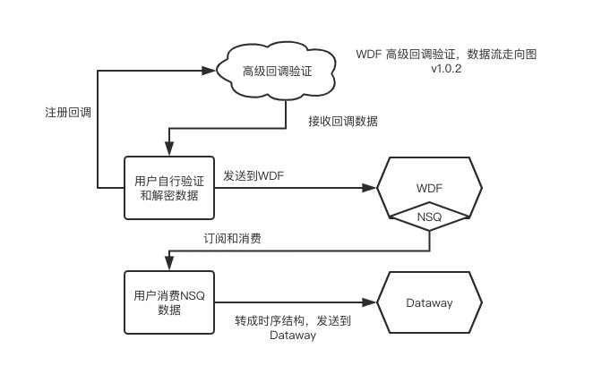
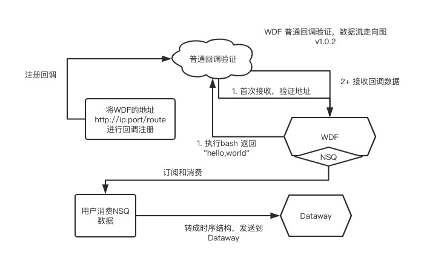

# Web Datakit Framework (WDF) Usage Doc

## 关于

- 此项目作为 dataflux dataway 关联构建，作为中间层负责数据暂存。

- 数据存储中间件使用 [NSQ ](https://nsq.io/)，用户需要配置 NSQ lookupd host 和`topic`等参数。

## 版本

> Version: v1.0.2

## 安装和使用

提供 4 种安装方式，详情查看*install.md*

## 配置文件

程序会自动加载当前目录下的`wdf.conf`，或使用`-cfg`参数指定。

配置文件的格式是**toml**，其中`callback`为数组，可以拥有多个。

``` toml
## 全局配置
[global]

  ## log 输出文件
  log_path = "/usr/local/cloudcare/forethought/wdf/log"

  ## log 是否开启 debug 打印，默认不开启
  log_debug = true

  ## 监听端口
  listen = ":8080"

  ## nsq lookupd 地址，需要添加协议头"http://"
  nsq_lookupd_addr = "http://nsqlookup:4161"

  ## 定时器存取的 topic，为空值时将不启动定时器
  timer_topic = "timer"

  ## 定时器周期，单位是秒，值小于等于 0 时不启动定时器
  timer_cycle = 0

## 回调组，可以有多个
[[callback]]

  ## http 路由：http://ip:port/TEST
  ## nsq 消费 topic：TEST
  route = "TEST"

  ## 验证脚本，除非需要验证，否则为空值
  # verify_bash = "/tmp/test.sh"
```
    
## 使用方式

### 复杂回调验证

此方式适用于较为复杂的回调情景，当注册回调和接收数据时需要大量的交互（包括权限验证、加密解密等），相关功能需要由用户自行完成，wdf 将作为数据队列使用。

示意图：



流程简述：

0. 启动 wdf 程序，配置相应的 callback route

1. 用户使用回调的官方 SDK 进行注册和验证，注意此时的注册 callback 地址是 SDK 的 http 服务，和 wdf 无关

2. 在成功注册，并能顺利接受和解析数据后，可以对数据进行添加或修改操作，然后创建 http 请求，将数据作为 body 发送给 wdf

### 普通回调验证

对于一些简单的回调，用户只需进行注册，回调消息的验证和数据的接收由 wdf 完成。

使用时配置`verify_bash`参数，wdf 得到一个 bash 脚本。

回调消息的验证，会在该 route 首次接收到 http 请求时，对其返回执行此 bash 脚本的标准输出，比如在脚本中编写：

``` bash
echo "hello,world"
```

当此 route 收到第一条请求后，会给该请求返回 body 为`hello,world`。

示意图：



**注意：**
	- 执行 bash 脚本并将标准输出作为返回的情况，只执行一次，此 url 从收到的第 2 条消息开始，便不再执行这段验证操作；

	- 即使该 bash 脚本执行出错，也算一次，后续将不在进行验证。此事件会在 log 中以`error`级别记录。


## 定时器

当定时器启动后，会每隔一段时间往 NSQ 的特定 topic 中发送一个字节的无意义数据，当 NSQ 的消费端订阅这个 topic 后，会定期收到这段数据达到定时功能。

### 使用方法

修改配置文件`global`中的`timer_topic`和`timer_cycle`项：

> timer_topic：定时器在 NSQ 中生产和消费的 topic

> timer_cycle: 周期，单位是秒

NSQ 订阅此 topic，会定期收到一个通知消息

注，当 “topic” 为空，或 “cycle” 小于等于 0 时，则认为不开启定时器功能，并在 log 中记录此事件。

## NSQ 消费数据

NSQ 拥有众多编程语言的实现库，可自行查阅，此处列出几种。

- [java](https://github.com/nsqio/TrendrrNSQClient)
- [python](https://github.com/nsqio/pynsq)
- [golang](https://github.com/nsqio/go-nsq)


