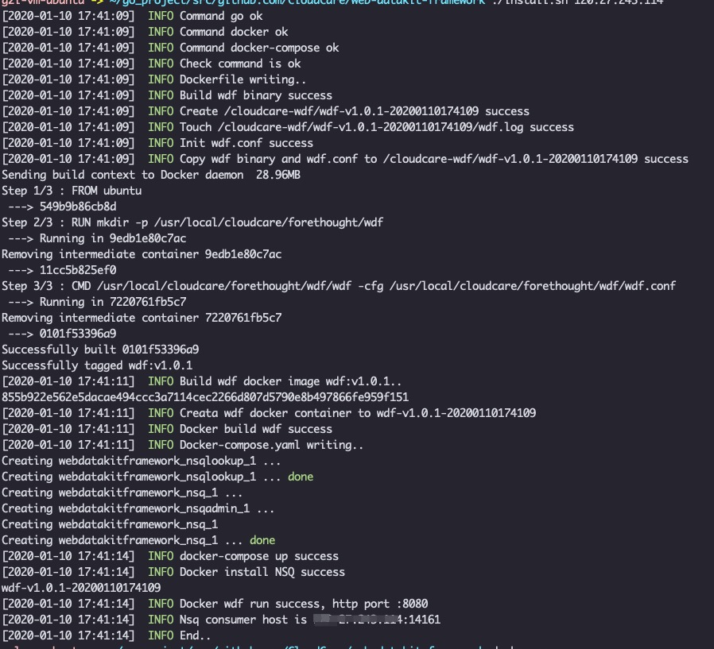
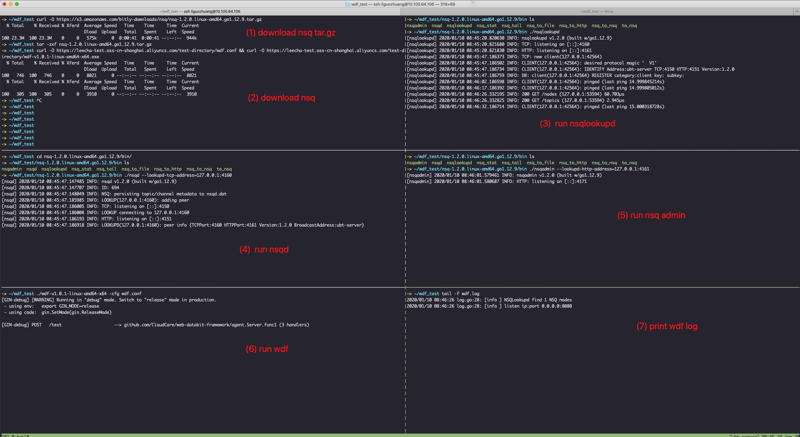
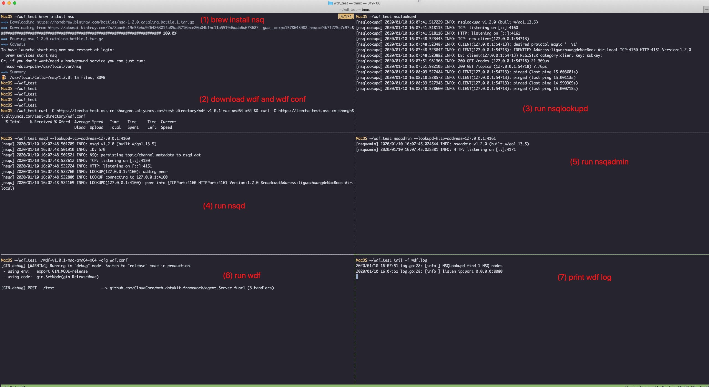
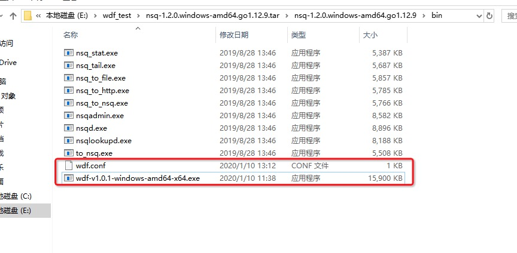
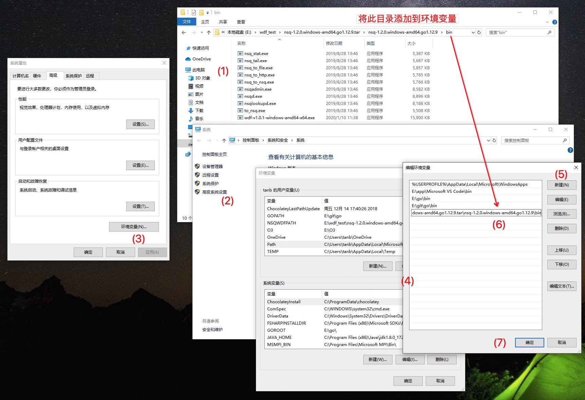
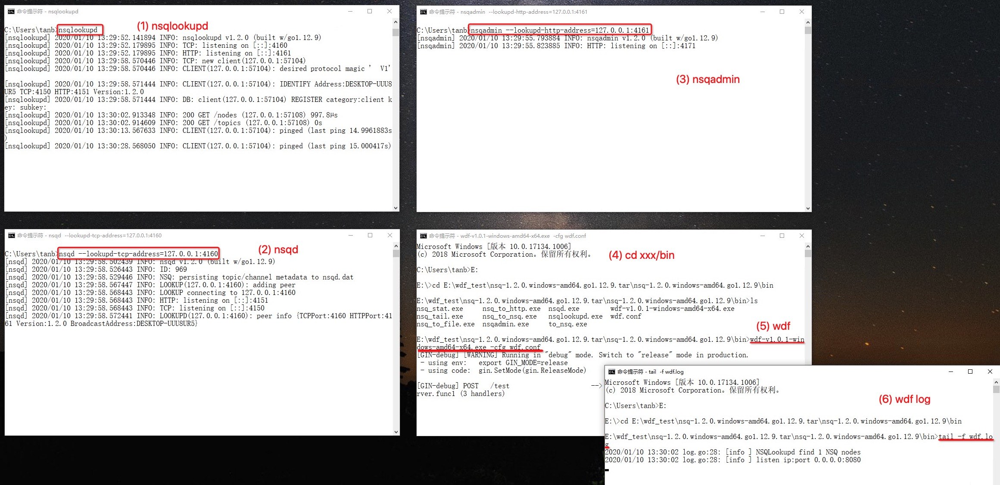
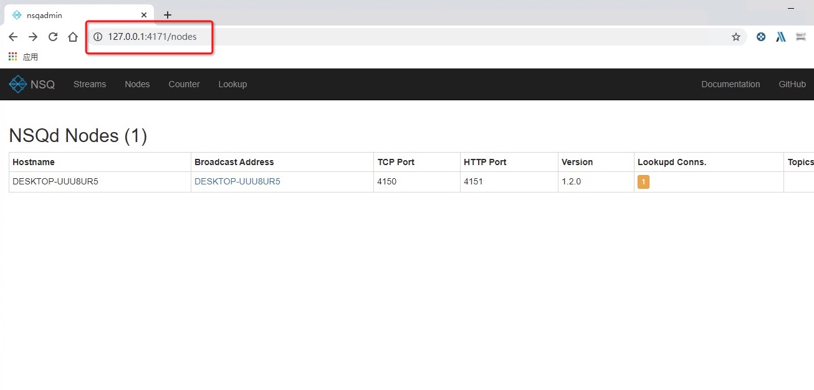

## Web Datakit Framework (WDF) Install Doc

本文为 wdf 程序和 [NSQ](https://nsq.io/) 在多种环境下的安装步骤，包括：

- [docker](#docker)
- [linux](#linux)
- [macOS](#macOS)
- [windows](#windows)

### docker

推荐安装方式。需要的安装环境：

> golang version 1.12.12 及以上版本

> docker verison 19.03.5 及以上版本

> docker-compose version 1.17.1 及以上版本

使用方式：

1. 使用 `git clone https://github.com/CloudCare/web-datakit-framework.git` 下载 wdf 项目。

2. 在终端中运行 `bash docker_install.sh $NSQLOOKUPD_IP`，其中，第二个参数为 NSQ lookupd 的消费地址，可以是内网 IP 或外网 IP，不可以是 127.0.0.1

3. 启动成功后，打印如下图：

    

4. 使用 `docker ps -a` 查看容器的运行状态，或查看 wdf log

### linux

此处演示的操作系统为 ubuntu 18.04 LTS Server版。

1. 使用 `curl -O `命令下载 wdf 和 NSQ 的执行文件包，下载地址见顶部，下载完成进行解压。

2. 进入到解压后的目录，执行运行命令分别如下：

    > 运行 NSQ 节点管理程序：`./nsqlookupd`
    
    > 运行 NSQ 节点：`./nsqd --lookupd-tcp-address=127.0.0.1:4160`
    
    > 运行 NSQ 管理程序：`./nsqadmin --lookupd-http-address=127.0.0.1:4161`
    
    > 运行 wdf 程序并指定配置文件：`./wdf-v1.0.1-linux-amd64-x64.exe -cfg wdf.conf`
    
    > 查看 wdf 程序的输出日志：`tail -f wdf.log`

3. wdf 和 NSQ 的安装、运行步骤如下图：

    

### macOS

此处演示的操作系统为 macOS 10.15.3。

1. 使用 `curl -O `命令下载 wdf 的执行文件包，下载地址见顶部，下载完成进行解压。

2. macOS 安装 NSQ 需要使用 brew，安装命令为：

    > `brew install nsq`

3. 依次运行 `nsqlookupd` 、`nsqd`、`nsqadmin`、`wdf`，执行命令分别如下：

    > 运行 NSQ 节点管理程序：`nsqlookupd`
    
    > 运行 NSQ 节点：`nsqd --lookupd-tcp-address=127.0.0.1:4160`
    
    > 运行 NSQ 管理程序：`nsqadmin --lookupd-http-address=127.0.0.1:4161`
    
    > 运行 wdf 程序并指定配置文件：`./wdf-v1.0.1-mac-amd64-x64.exe -cfg wdf.conf`
    
    > 查看 wdf 程序的输出日志：`tail -f wdf.log`

4. wdf 和 NSQ 的安装、运行步骤如下图：

    

### windows

1. 首先安装 NSQ windows 版本，[官方下载地址](https://nsq.io/deployment/installing.html)在此。下载后的文件格式为`.tar.gz`，需要另外安装程序[7-zip](https://www.7-zip.org/)进行解压。

2. 下载 wdf 执行文件包，下载地址见文档顶部。下载后解压到 NSQ 文件的目录，方便后面添加环境变量。wdf 运行的执行程序已经集齐，文件列表如图：

    

3. 为 wdf 和 NSQ 的执行文件目录添加环境变量，右键“电脑”进入“高级系统设置”选择“环境变量”，选则“PATH”再进行添加。具体操作步骤可查看下图：

    

4. 打开多个 windows 的 cmd 程序，可以使用`ctrl + r`快捷键，输入`cmd` 按回车打开。前3个 cmd 窗口分别运行 NSQ 的程序，后2个 cmd 窗口进入到 wdf 所在的目录，用以执行 wdf 程序和查看输出log。

    各个程序的执行命令分别是：
    
    > 运行 NSQ 节点管理程序：`nsqlookupd`
    
    > 运行 NSQ 节点：`nsqd --lookupd-tcp-address=127.0.0.1:4160`
    
    > 运行 NSQ 管理程序：`nsqadmin --lookupd-http-address=127.0.0.1:4161`
    
    > 运行 wdf 程序并指定配置文件（注意此处 wdf 执行文件名称视版本不同而变化）：`wdf-v1.0.1-windows-amd64-x64.exe -cfg wdf.conf`
    
    > 查看 wdf 程序的输出日志：`tail -f wdf.log`

    如图：

    

   如果 wdf 的输出结果和图中`5``6`基本相同，没有出现报错，则证明 wdf 和 NSQ 程序已经顺利启动。

5. 此时操作系统已经开始监听 wdf 指定的端口，向该端口发送 HTTP 数据会被接收到。另，在浏览器中输入`127.0.0.1:4171`可以管理 NSQ 的行为。如图：

    
